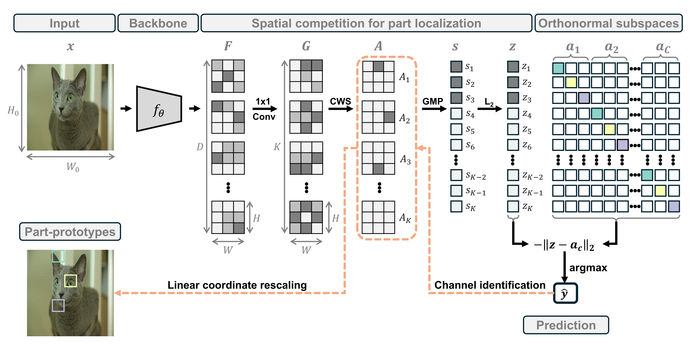

<h1 align="center">💎OPAL: Orthonormal Prototype and Parts Learning<br>for Interpretable Image Classification</h1>

<p align="center"><b>Anonymous ECCV 2026 Submission</b></p>
<p align="center">Paper ID <b>#14856</b></p>

<br>

<div align="center">
    
</div>

---

### TL;DR

<p align="justify">
Prototypical part-based models provide explainable predictions by comparing input regions to learned prototypes. However, current approaches are burdened by complex, multi-stage training pipelines and heavily rely on auxiliary regularization to prevent prototype collapse. To overcome these limitations, we introduce <b>Orthonormal Prototype Alignment Learning (OPAL)</b>, a single-stage, end-to-end framework that simplifies interpretable classification. Our approach anchors the latent space using predefined orthonormal bases, embedding each class within a dedicated subspace spanned by fixed part-prototypes. To achieve precise part localization, OPAL enforces spatial competition across feature maps. This mechanism isolates sparse, discriminative regions, directing each prototype to consistently attend to the same semantic concept across different images. By framing classification as a direct representation alignment task, our method eliminates the need for auxiliary losses. Extensive experiments on fine-grained benchmarks demonstrate that OPAL outperforms both its non-interpretable counterparts and state-of-the-art part-prototype methods, delivering granular visual explanations by explicitly revealing the specific image regions driving every prediction.
</p>

---

## Table of Contents

- [Repository Structure](#repository-structure)
- [Setup](#setup)
  - [Docker (Recommended)](#option-a-docker-recommended)
  - [Conda](#option-b-conda)
- [Data](#data)
- [Running Experiments](#running-experiments)
  - [Command-Line Arguments](#command-line-arguments)
  - [Example Usage](#example-usage)
- [Output Structure](#output-structure)

---

## Repository Structure

```
src/
├── main.py                  # Entry point: training, evaluation, and visualization pipeline
├── requirements.txt         # Python dependencies
├── README.md                # This file
├── assets/                  # Static assets (figures, diagrams)
├── net/                     # Model definitions
│   ├── baseline.py          # Feature extractor backbones (ConvNeXt, EfficientNet-V2, ResNet),
│   │                        #   1×1 conv projection layer, and adaptive pooling utilities
│   ├── classifiers.py       # Classification heads: prototype-based (orthonormal subspaces)
│   │                        #   and linear classifiers with multiple distance metrics
│   └── net_model.py         # Full model architectures (NNModel, NNModel_softmax) combining
│                            #   backbone, conv layer, pooling, normalization, and classifier
├── train_eval/              # Training and evaluation loops
│   └── train_val.py         # Training epoch, validation epoch, loss computation
└── utils/                   # Utility modules
    ├── args.py              # Command-line argument definitions
    ├── data.py              # Dataset loading, augmentation pipelines, train/val splitting
    ├── metrics.py           # Quantitative classification metrics (ACC, SEN, SPE, PPV, F1, AUC)
    ├── misc.py              # Seed management and directory counting helpers
    └── viz.py               # t-SNE plots, training curves, prototype overlays, and
                             #   Spatial Prototype Collapse (SPC) computation
```

---

## Setup

### Option A: Docker (Recommended)

We provide a Docker-based workflow using the NVIDIA PyTorch container, which bundles all major dependencies (PyTorch, torchvision, CUDA).

1. **Pull and run the container**, mounting your project directory:

```bash
docker run \
  --name opal \
  --gpus '"device=0"' \
  --ipc=host \
  -it --rm \
  -v /path/to/your/project:/Workspace \
  -w /Workspace \
  nvcr.io/nvidia/pytorch:23.10-py3
```

> **Note:** Replace `/path/to/your/project` with the absolute path to the directory containing both `src/` (source code) and `data/` (datasets).

2. **Install the two additional packages** inside the container:

```bash
pip install plotly openpyxl
```

You are now ready to run experiments from the `src/` directory.

### Option B: Conda

```bash
conda create --name opal python=3.10 -y
conda activate opal
pip install -r requirements.txt
```

---

## Data

The code can be applied to any image classification dataset structured according to the [ImageFolder](https://pytorch.org/vision/stable/generated/torchvision.datasets.ImageFolder.html) format:

```
root/class1/xxx.png
root/class1/xxy.png
root/class2/xyy.png
root/class2/yyy.png
```

### Supported Datasets

| Dataset | Link |
|---------|------|
| CUB-200-2011 | https://www.vision.caltech.edu/datasets/cub_200_2011/ |
| Stanford Cars | https://docs.pytorch.org/vision/main/generated/torchvision.datasets.StanfordCars.html |
| Oxford-IIIT Pets | https://www.robots.ox.ac.uk/~vgg/data/pets/ |
| Stanford Dogs | http://vision.stanford.edu/aditya86/ImageNetDogs/ |
| Oxford Flowers | https://www.robots.ox.ac.uk/~vgg/data/flowers/ |

### Preprocessing

After downloading, each dataset must be converted into the ImageFolder structure shown above (separate `train/` and `test/` directories, each containing one subdirectory per class). For a concrete example of how to reorganize a raw dataset into the expected directory layout, see the [CUB preprocessing script](https://github.com/M-Nauta/PIPNet/blob/main/util/preprocess_cub.py) from the PIPNet repository.

---

## Running Experiments

### Command-Line Arguments

| Argument | Type | Default | Description |
|----------|------|---------|-------------|
| `--output_dir` | str | `../OUTPUTS_OPAL` | Directory to save all outputs |
| `--config_dir` | str | `None` | Path to a `.txt` file with saved arguments |
| `--dataset` | str | `CUB-200-2011` | Dataset name |
| `--data_dir` | str | `data/CUB_200_2011/dataset` | Path to the dataset (must contain `train/` and `test/`) |
| `--img_size` | int | `224` | Input image resolution |
| `--num_classes` | int | `200` | Number of classes |
| `--data_aug` | bool | `True` | Enable data augmentation |
| `--base_model` | str | `convnext_tiny` | Backbone architecture (`convnext_tiny`, `convnext_small`, `convnext_base`, `resnet50`, `resnet101`, `resnet152`, `efficientnet_v2_s`, `efficientnet_v2_m`, `efficientnet_v2_l`) |
| `--pretrain` | bool | `True` | Initialize backbone with ImageNet-pretrained weights |
| `--pooling` | str | `max` | Global pooling strategy: `avg` or `max` |
| `--classifier` | str | `norm_prototypes_dist` | Classification head: `linear` or `norm_prototypes_dist` |
| `--metric` | str | `euclidean` | Distance metric: `euclidean`, `lp`, `chebyshev`, `tropical`, `kl` |
| `--p` | int | `2` | Exponent for the Lp metric (ignored by other metrics) |
| `--ch_last_conv` | int | `5` | Number of 1×1 conv filters per class (0 = keep backbone channels) |
| `--model` | str | `NNModel_softmax` | Model variant: `NNModel` (no activation) or `NNModel_softmax` (channel-wise softmax) |
| `--seed` | int | `42` | Random seed |
| `--epochs` | int | `30` | Number of training epochs |
| `--batch_size` | int | `64` | Batch size |
| `--lr` | float | `1e-4` | Learning rate |
| `--lr_scheduler` | bool | `False` | Enable learning rate scheduler |
| `--optimizer` | str | `Adam` | Optimizer |
| `--weight_decay` | float | `0.0` | Weight decay |
| `--num_workers` | int | `0` | DataLoader worker count |
| `--save_model` | bool | `True` | Save best model checkpoint |
| `--save_metrics` | bool | `True` | Save quantitative metrics (ACC, F1, AUC, etc.) |
| `--save_curves` | bool | `True` | Save training/validation loss and accuracy curves |
| `--save_tsne` | bool | `True` | Save interactive t-SNE embedding plots |
| `--save_arch_proto` | bool | `False` | Save prototype visualizations |
| `--save_collapse_metrics` | bool | `True` | Compute and save Spatial Prototype Collapse (SPC) metrics |

### Example Usage

**Train on CUB-200-2011 with default settings:**
```bash
cd src
python main.py \
  --dataset CUB-200-2011 \
  --data_dir ../data/CUB_200_2011/dataset \
  --base_model convnext_tiny \
  --classifier norm_prototypes_dist \
  --epochs 30
```

**Train on Stanford Cars with a ResNet-50 backbone:**
```bash
cd src
python main.py \
  --dataset CARS \
  --data_dir ../data/CARS/dataset \
  --base_model resnet50 \
  --num_classes 196 \
  --classifier norm_prototypes_dist \
  --metric euclidean \
  --epochs 30
```

**Train with a linear classifier baseline:**
```bash
cd src
python main.py \
  --dataset CUB-200-2011 \
  --data_dir ../data/CUB_200_2011/dataset \
  --base_model convnext_tiny \
  --classifier linear \
  --pooling avg \
  --ch_last_conv 0 \
  --model NNModel \
  --epochs 30 \
  --save_collapse_metrics False
```

---

## Output Structure

Each experiment creates a self-contained directory under `--output_dir` (default: `OUTPUTS_OPAL/`), named with the pattern `{dataset}_{backbone}_{classifier}_{run_id}`:

```
OUTPUTS_OPAL/
└── CUB-200-2011_convnext_tiny_norm_prototypes_dist_1/
    ├── logs/
    │   └── args.txt               # Full argument configuration for reproducibility
    ├── checkpoint/
    │   └── *.pth                  # Best model weights (lowest validation loss)
    ├── metrics/
    │   ├── *.xlsx                 # Per-split classification metrics (ACC, SEN, SPE, PPV, F1, AUC)
    ├── train_val_curves/
    │   └── *.png                  # Loss and accuracy curves over epochs
    ├── tsne/
    │   └── *.html                 # Interactive t-SNE embedding plot (train/val/test)
    └── prototypes_viz/            # Prototype overlay visualizations (if enabled)
```

| Subfolder | Contents |
|-----------|----------|
| `logs/` | Argument log (`args.txt`) recording all hyperparameters and settings |
| `checkpoint/` | Best model checkpoint (`.pth`) selected by lowest validation loss |
| `metrics/` | Quantitative results: accuracy, sensitivity, specificity, PPV, NPV, F1, AUC (per split) |
| `train_val_curves/` | Training and validation loss/accuracy plots |
| `tsne/` | Interactive HTML t-SNE scatter plots of learned embeddings |
| `prototypes_viz/` | Prototype activation overlays on test images (requires `--save_arch_proto True`) |

Multiple runs with the same configuration are automatically numbered (e.g., `_1`, `_2`, …).